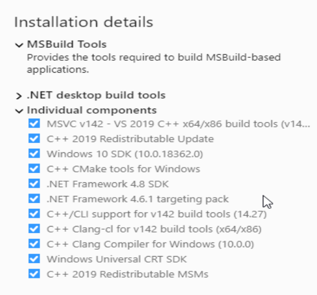

# Building bubble-flexrouter on Windows

## Install MSVC build tools
Go to https://visualstudio.microsoft.com/downloads/

Download and run the installer. You don't need to install everything. Here's a screenshot showing which components
need to be installed:

[Screenshot of Windows Build Tools Installer](img/win-build-tools-installer.png)

## Install npcap
Go to https://nmap.org/npcap

Download and run the installer. As of this writing, the latest is https://nmap.org/npcap/dist/npcap-0.9997.exe

When you install npcap, the installation option "" should be enabled.

## Install WinPcap development library
Go to https://www.winpcap.org/devel.htm

Download and install the library. As of this writing, the latest is: https://www.winpcap.org/install/bin/WpdPack_4_1_2.zip

Unzip the zipfile.

### For 64-bit Windows
Copy Packet.lib from Lib/x64 to the bubble-flexrouter directory

### For 32-bit Windows
Copy Packet.lib from Lib to the bubble-flexrouter directory

## Build it
Run `cargo build` to build the program
